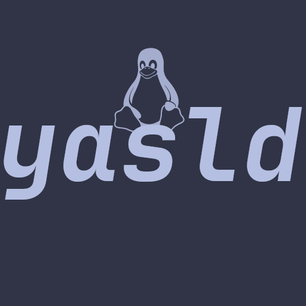

# YASLD

<p align="center">
  <b>Yet Another Shitty Linux Distro</b>
</p>



<p align="center">
  A tiny experimental Linux distro built from the latest kernel (may be unstable), Limine, initramfs, and a Go-based userland.
</p>

---

## What is this?

**YASLD** is a small toy Linux distribution project.

It boots a Linux kernel with **Limine**, loads a custom **initramfs**, and starts a minimal userspace powered by **Gobox**.

This is not meant to be a serious distro.  
It is mostly for learning, experimenting, breaking things, and understanding how Linux userspace bootstrapping works.

## Build

```bash
make iso 
# or with gcc
make iso WITH_GCC=1
```

## Userland

YASLD uses **Gobox** as its userland:

```txt
https://github.com/segfaultuwu/gobox
```
